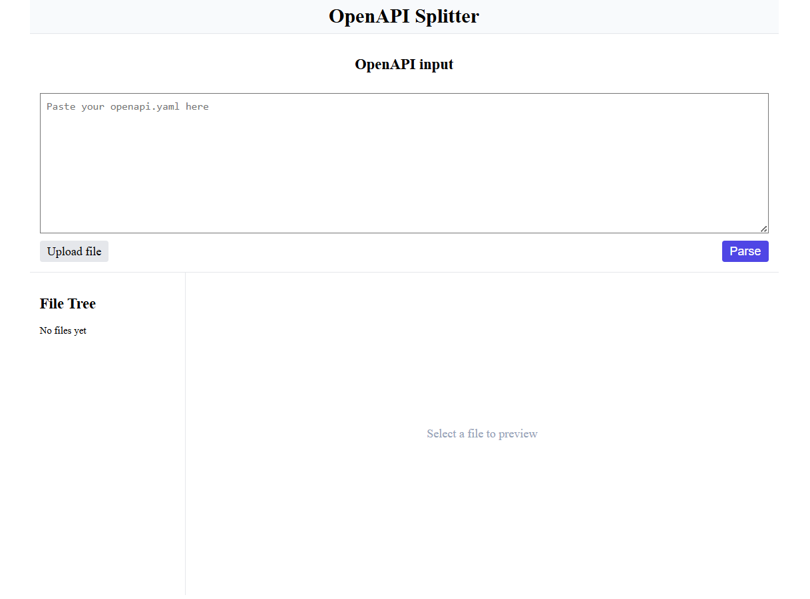
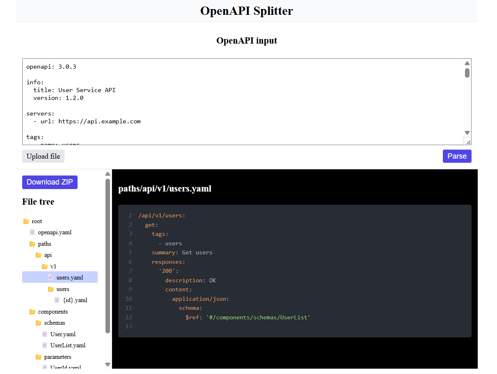

# OpenAPI Splitter

Web application for parsing an OpenAPI YAML document and splitting it into a structured virtual file tree with the ability to preview files and download them as a ZIP archive.

---

## Screenshot




---

🔗 Live Demo: https://openapi-splitter.netlify.app/

---

## Features

- Paste OpenAPI YAML into textarea
- Automatically build a virtual file tree
- Recursive folder structure generation
- File preview panel
- Download generated structure as ZIP
- Error handling for invalid YAML
- Full unit & component test coverage
- Animated preloader before React mount

---

## Tech Stack

- **Core**
  - React
  - TypeScript
  - Redux Toolkit
  - Vite
- **Testing**
  - Vitest
  - React Testing Library
  - user-event
- **Utilities**
  - JSZip
  - file-saver
  - js-yaml

---

## Architecture

Project structure follows a modular feature-based approach:

```src/
  app/                 # Store and app-level setup
  entities/            # Pure business logic (tree building, search)
  features/
    openapi-splitter/  # OpenAPI parsing logic
    file-tree/         # File tree UI
    upload/            # YAML upload & parsing
    viewer/            # File preview
  shared/
    ui/                # Reusable UI components
    styles/            # Global styles
```
---

## How to run locally

```bash
# Clone the repo
git clone https://github.com/Tatiana-Golub/openapi-splitter.git
cd openapi-splitter

# Install dependencies
npm install

# Start the development server
npm run dev


